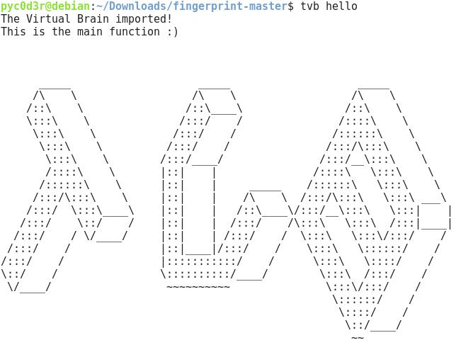

# Neuropackage
>Simple Package(Example) for packaging Tvb to Neurodebian

* To test it.
Clone this repository

# Install from source
```sh
$ sudo cd tvb-neurodebian-0.0.1/ && debi
```

# Install from package
```sh
$ sudo gdebi tvb-neurodebian_0.0.1-1_amd64.deb
```
# Test and Run

```sh
$ tvb Hello-World
```

#ScreenShot


